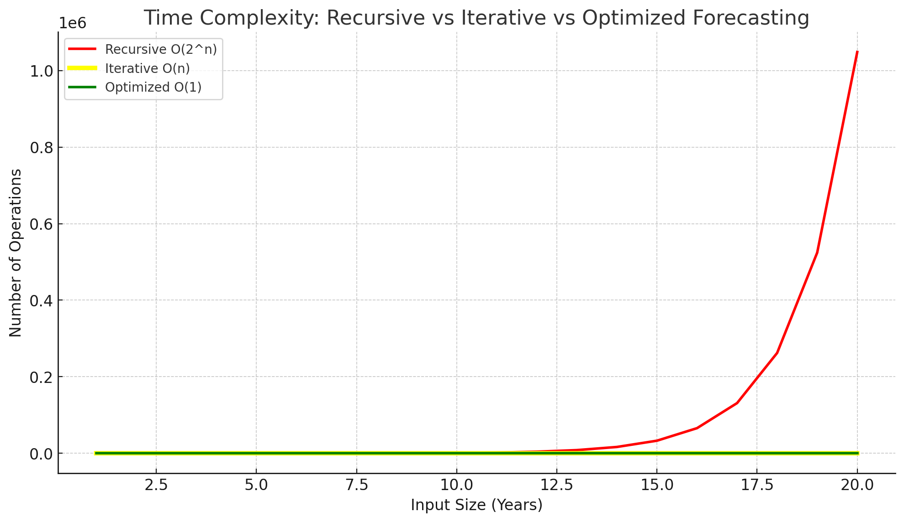

# 📈 Financial Forecasting Tool

A simple Java-based tool that predicts **future financial values** using **recursive algorithms** based on past data and an annual growth rate.

---

## 📘 What is Recursion?

**Recursion** is a method where the solution to a problem depends on solving smaller instances of the same problem. A recursive method calls itself with modified parameters and stops when it reaches a base case.

> Example:  
To calculate value after `n` years:  
**FutureValue(n) = FutureValue(n - 1) × (1 + growthRate)**

---

## 🧮 Forecasting Formula

This tool assumes **compound annual growth** using the formula:


---

### 🔁 Recursive Version

```java
public class FinancialForecast {


  
    public static double forecastValue(double currentValue, double growthRate, int years) {
        if (years == 0) {
            return currentValue;
        }

        return forecastValue(currentValue * (1 + growthRate), growthRate, years - 1);
    }


```
### 🔁 Iterative Version
```java
public static double forecastValueIterative(double currentValue, double growthRate, int years) {
    for (int i = 0; i < years; i++) {
        currentValue *= (1 + growthRate);
    }
    return currentValue;
}
```

### 🧠 Optimized Version

```java
public static double forecastValueOptimized(double currentValue, double growthRate, int years) {
    return currentValue * Math.pow(1 + growthRate, years);
}
```

```java

     public static void main(String[] args) {
        double initialValue = 1000.0; // Initial investment
        double annualGrowthRate = 0.10; // 10% annual growth
        int years = 5;

        double forecastedValue = forecastValue(initialValue, annualGrowthRate, years);
        double forecastedValueIterative = forecastValueIterative(initialValue, annualGrowthRate, years);
        double forecastedValueOptimized = forecastValueOptimized(initialValue, annualGrowthRate, years);
        System.out.printf("Forecasted value after %d years: %.2f\n", years, forecastedValue);
        System.out.printf("forecastedIterative value after %d years: %.2f\n", years, forecastedValueIterative);
        System.out.printf("forecastedOptimized value after %d years: %.2f\n", years, forecastedValueOptimized);
    }


}    
```
### ✅ Sample Output:
```yml
Forecasted value after 5 years: 1610.51
forecastedIterative value after 5 years: 1610.51   
forecastedOptimized value after 5 years: 1610.51
```
---
## 📷 UML Diagram

---
---

---
### ✅ Conclusion
This project demonstrates:

- The power and simplicity of recursion

- Comparing recursive vs. iterative vs. mathematical approaches

- Importance of time complexity in forecasting applications

### 📌 Topics Covered
- Recursion

- Time Complexity

- Financial Forecasting

- Java Programming