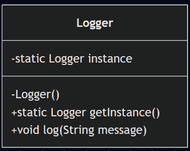

# Singleton Design Pattern in Java

## 📌 What is the Singleton Pattern?

The **Singleton Design Pattern** is a **creational pattern** that ensures a class has **only one instance** and provides a **global access point** to that instance.

This pattern is especially useful when exactly **one object** is needed to coordinate actions across the system. It ensures controlled access to shared resources like configuration settings, logging, or database connections.

### ✅ Key Characteristics:
- **Single Instance**: Only one object of the class exists in the entire application.
- **Global Access Point**: The instance can be accessed from anywhere using a static method.
- **Lazy Initialization**: The instance is created only when it's needed (optional).
- **Encapsulation**: The instance variable is kept private.

### 🧠 Real-world Example:
A **Logger** class should only have **one instance** to ensure consistent logging behavior throughout the application.


---
## 📷 UML Diagram


  
---
## 🚀 How We Implemented Singleton (Step-by-Step)

### 👨‍💻 Step 1: Create the Singleton Class (`Logger.java`)

```java
public class Logger {

    // Step 1: Create a private static variable of the same class
    private static Logger instance;

    // Step 2: Make the constructor private to prevent external instantiation
    private Logger() {
        System.out.println("Logger instance created.");
    }

    // Step 3: Provide a public static method to return the instance
    public static Logger getInstance() {
        if (instance == null) {
            instance = new Logger(); // create new instance if none exists
        }
        return instance;
    }

    // Step 4: Define a method to simulate logging
    public void log(String message) {
        System.out.println("[LOG] " + message);
    }
}
```

### 👨‍🔬 Step 2: Create a Test Class (`Main.java`)

```java
public class Main {
    public static void main(String[] args) {
        // Get the singleton instance of Logger
        Logger logger1 = Logger.getInstance();
        Logger logger2 = Logger.getInstance();

        // Use the logger
        logger1.log("This is the first log message.");
        logger2.log("This is the second log message.");

        // Verify that both logger1 and logger2 refer to the same instance
        if (logger1 == logger2) {
            System.out.println("Only one instance exists. Singleton works!");
        } else {
            System.out.println("Different instances exist. Singleton failed!");
        }
    }
}
```
### ✅ Sample Output:
```pgsql
Logger instance created.
[LOG] This is the first log message.
[LOG] This is the second log message.
Only one instance exists. Singleton works!
```

### 🧵 Optional: Making Singleton Thread-Safe
To ensure thread safety in multithreaded environments, you can use:

- Synchronized method

- Double-checked locking

- Enum-based Singleton (best practice in Java)

### 📚 Summary

| Feature              | Status       |
|----------------------|--------------|
| Single Instance      | ✅ Ensured   |
| Global Access Point  | ✅ Available |
| Lazy Initialization  | ✅ Implemented |
| Thread Safety        | ❌ Not yet (can be added) |


### 📌 Conclusion
This project demonstrates how the Singleton pattern can be effectively used to control object creation and ensure a single point of access to shared functionality, like logging. It helps in maintaining clean code and preventing unnecessary resource usage.


