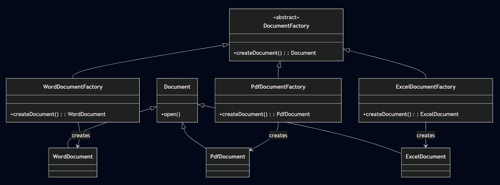

# 🏭 Factory Method Pattern - Document Management System

## 📖 What is the Factory Method Pattern?

The **Factory Method Pattern** is a **creational design pattern** that provides an interface for creating objects in a superclass but allows subclasses to alter the type of objects that will be created.

Instead of instantiating objects directly using the `new` keyword, this pattern uses a **factory method** to create objects. This promotes **loose coupling**, **scalability**, and adheres to the **Open/Closed Principle** of SOLID design — making it easy to introduce new types without modifying existing code.

---

## 🎯 When to Use It
- When the exact type of the object is determined at runtime.
- When the creation process should be abstracted from the client.
- When multiple related classes share a common interface.

---

## 🧠 Problem Scenario

You're developing a **document management system** that supports multiple document formats like:
- Word
- PDF
- Excel

Each document type should be handled differently but created using a consistent process — without tightly coupling your code to specific classes. That’s where the Factory Method Pattern helps.

---

## 🧪 Implementation Overview

### ✅ Step 1: Create a Common Interface

```java
// Document.java
public interface Document {
    void open();
}
```

### ✅ Step 2: Create Concrete Document Classes

```java
// WordDocument.java
public class WordDocument implements Document {
    public void open() {
        System.out.println("Opening a Word document.");
    }
}
```

```java
// PdfDocument.java
public class PdfDocument implements Document {
    public void open() {
        System.out.println("Opening a PDF document.");
    }
}
```

```java
// ExcelDocument.java
public class ExcelDocument implements Document {
    public void open() {
        System.out.println("Opening an Excel document.");
    }
```

✅ Step 3: Define an Abstract Factory

```java
// DocumentFactory.java
public abstract class DocumentFactory {
    public abstract Document createDocument();
}
```

### ✅ Step 4: Create Concrete Factories

```java
// WordDocumentFactory.java
public class WordDocumentFactory extends DocumentFactory {
    public Document createDocument() {
        return new WordDocument();
    }
}
```

```java
// PdfDocumentFactory.java
public class PdfDocumentFactory extends DocumentFactory {
    public Document createDocument() {
        return new PdfDocument();
    }
}

```
```java
// ExcelDocumentFactory.java
public class ExcelDocumentFactory extends DocumentFactory {
    public Document createDocument() {
        return new ExcelDocument();
    }
}

```
### ✅ Step 5: Test in Main Class

```java
// Main.java
public class Main {
    public static void main(String[] args) {
        DocumentFactory wordFactory = new WordDocumentFactory();
        Document doc1 = wordFactory.createDocument();
        doc1.open();  // Output: Opening a Word document.

        DocumentFactory pdfFactory = new PdfDocumentFactory();
        Document doc2 = pdfFactory.createDocument();
        doc2.open();  // Output: Opening a PDF document.

        DocumentFactory excelFactory = new ExcelDocumentFactory();
        Document doc3 = excelFactory.createDocument();
        doc3.open();  // Output: Opening an Excel document.
    }
}
```
### ✅ Sample Output:
```mathematica
Opening a Word document.
Opening a PDF document.
Opening an Excel document.
```
---
## 📷 UML Diagram

---

## ✅ Summary

| Feature                     | Status           |
|-----------------------------|------------------|
| Common Interface for Products | ✅ Implemented  |
| Concrete Document Types       | ✅ Done         |
| Abstract Factory              | ✅ Created      |
| Concrete Factories            | ✅ Implemented  |
| Factory Method Usage          | ✅ Demonstrated |

### 📈 Benefits of the Factory Method Pattern
- 🔄 Loose Coupling – Client code is decoupled from concrete implementations.

- 🧩 Scalability – Add new document types with ease.

- 🧼 Maintainability – Follows SOLID principles for clean architecture.

---